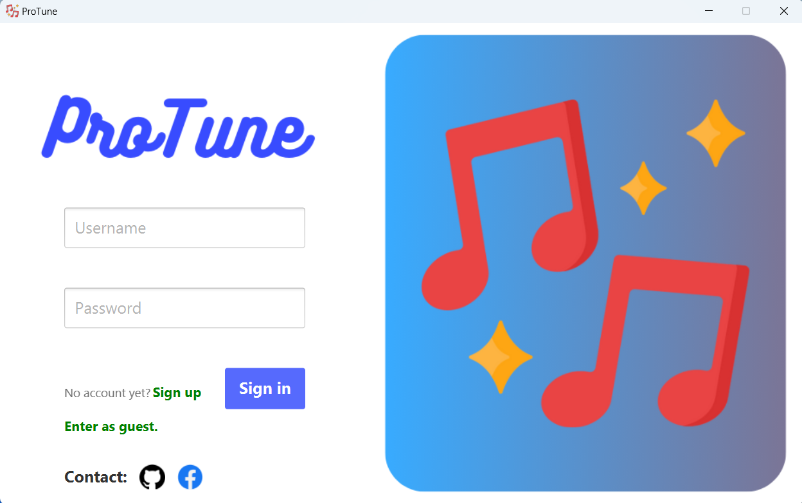
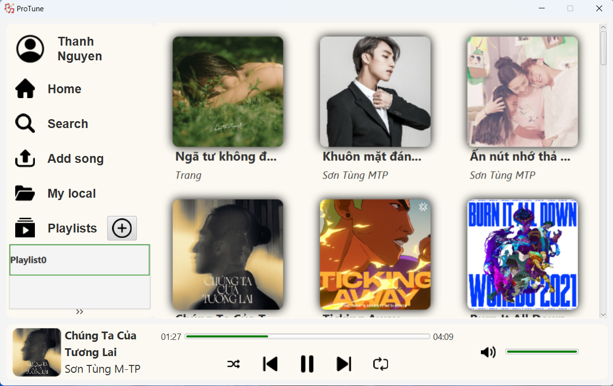
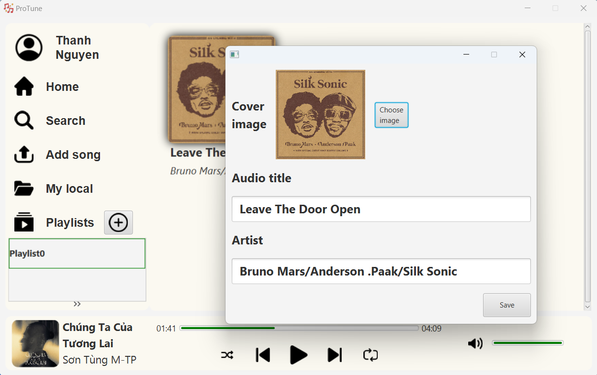
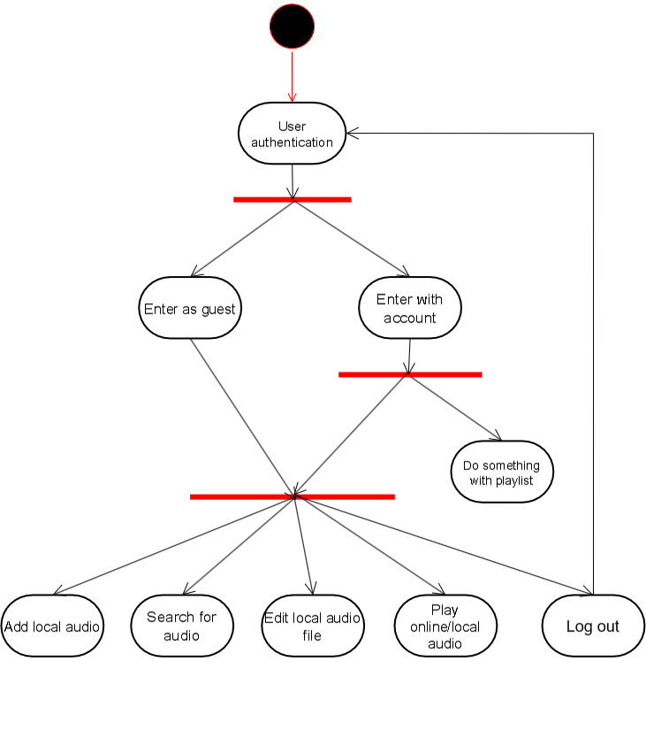
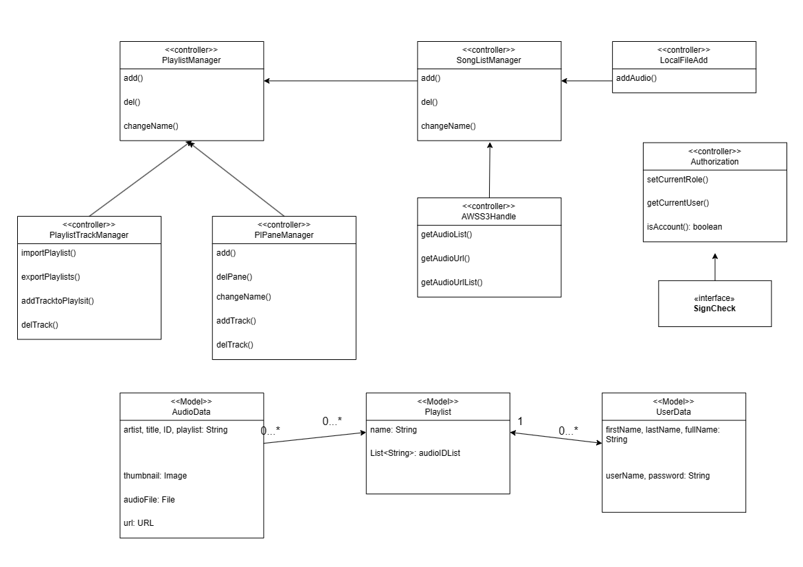

# ProTune

## Mô tả: 
Đây là một ứng dụng desktop dùng để nghe nhạc trực tuyến, hoặc từ thiết bị của bạn

##### Author: [NgNhatThanh](https://github.com/NgNhatThanh)   

## Demo: [Video demo](https://youtu.be/2QaZM-9FqP8)

## Các tính năng:
- Đăng nhập / Đăng ký
- Nghe các bài nhạc trực tuyến mà mình đã up
    - **Note**: kho nhạc online của mình có thể ngừng hoạt động, lúc đó app sẽ không có những bài nhạc này nữa, nhưng các chức năng khác vẫn bình thường
- Nghe / chỉnh sửa các bài nhạc được up từ máy 
- Tạo playlist riêng

## Cách cài đặt:
- Cài JDK
- Clone repo này
- Chạy file "ProTune.jar" để khởi động ứng dụng
##### Note: ứng dụng có thể bị "Not respoding" trong lúc khởi động, nếu gặp hãy thử khởi động lại

## Ảnh demo

## UML
**Activity diagram**

**Class diagram**

## License

[MIT](https://choosealicense.com/licenses/mit/)

